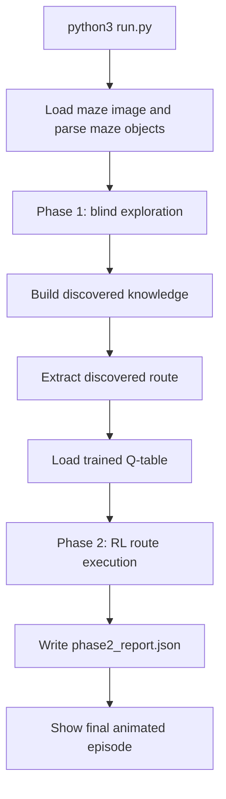
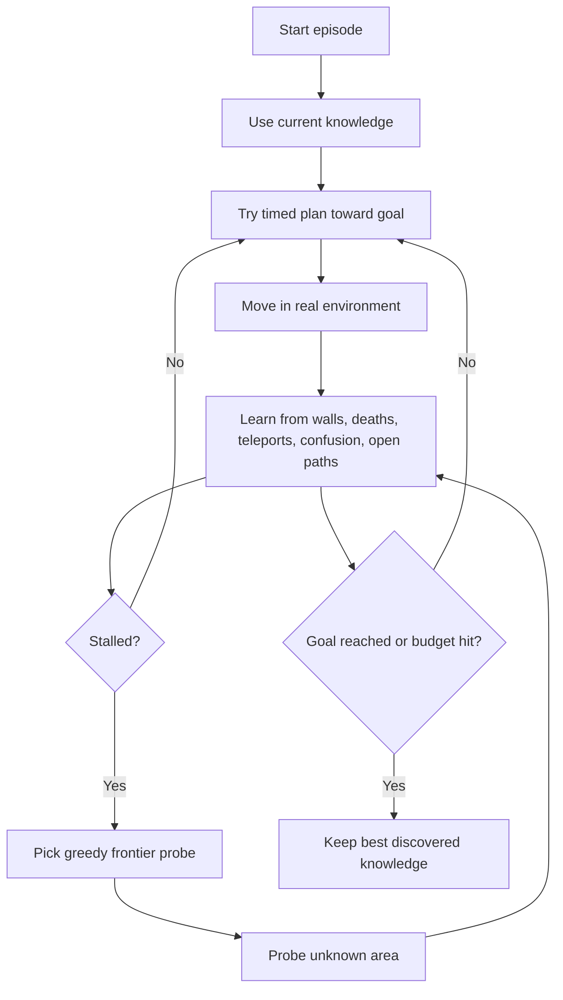
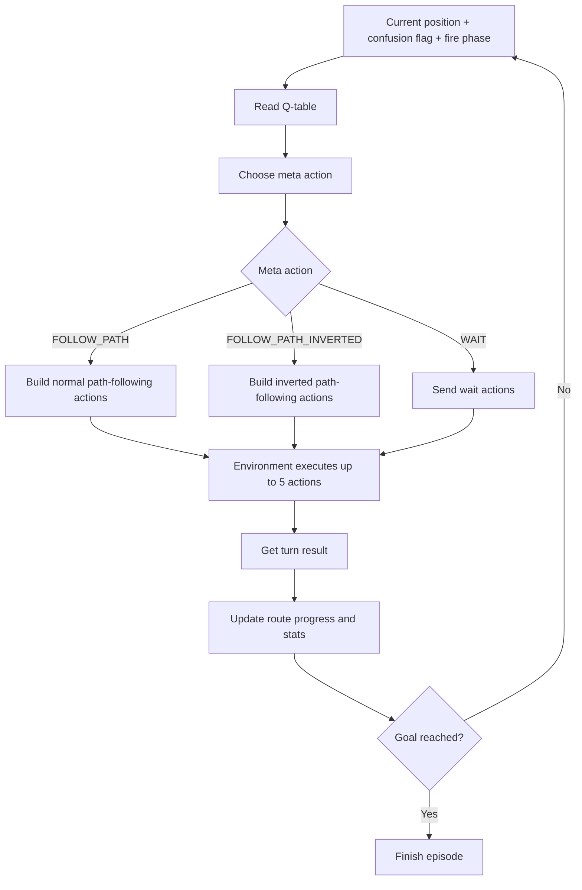

# MazeBot

MazeBot is a two-phase maze solving project written in Python.

The main idea is simple:

1. Phase 1 explores the maze without knowing everything in advance.
2. Phase 2 uses reinforcement learning (RL) to safely follow the route discovered in phase 1.

The main entry point of this project is:

```bash
python3 run.py
```

This README explains `run.py` in simple language and treats it as the real main flow of the project.

## What This Project Is

This project solves a maze from an image file.

The maze is not just walls and empty cells. It can also contain:

- fire that changes over time
- confusion tiles that reverse movement directions
- teleports
- one-way gates

Because of that, solving the maze is not just "find a shortest path once and walk it."

The project splits the job into two parts:

- Phase 1 learns the maze by experience
- Phase 2 decides how to execute the learned route under dangerous maze rules

## Language And Main Libraries

- Language: Python 3
- Numeric arrays: `numpy`
- Image parsing: `opencv-python` / `cv2`
- Animation / visualization: `matplotlib`

## Main Entry Point

`run.py` is the main program.

When you run it, it does this:

1. Loads the maze image `maze_gamma.png`
2. Prints the start and goal cells
3. Runs blind exploration to build knowledge of the maze
4. Extracts a route from the discovered knowledge
5. Loads an existing trained RL Q-table from `qtable.json`
6. Runs the RL endgame on top of that discovered route
7. Writes `phase2_report.json`
8. Plays a final animated run

Important:

- `run.py` does not train the Q-table
- `run.py` expects `qtable.json` to already exist and be compatible
- if the Q-table is missing or outdated, `run_RL.py` is the retraining helper, but `run.py` is still the main project pipeline

## High-Level Two-Phase Flow



## Which Search Logic `run.py` Uses

`run.py` uses more than one search idea.

That is important, because the whole project is not just "A*" and it is not just "BFS" either.

### Phase 1 uses:

- greedy frontier probing to decide which unknown area to test next
- a timed A*-style planner to physically move through the maze while respecting known fire timing
- repeated episodes that keep memory from earlier runs

### After phase 1 finishes:

- BFS is used to extract the final discovered route through the graph the explorer learned

### Phase 2 uses:

- RL to choose how to follow that route
- not fresh full A* replanning every turn in `run.py`

So the clearest summary is:

**Phase 1 = exploration and map building**

**Route extraction = BFS on discovered knowledge**

**Phase 2 = RL-guided route following**

## Phase 1 In Simple Language

Phase 1 is the "learn the maze first" part.

The explorer does not start with the full maze map.
It has to discover useful information by actually moving in the environment.

### What Phase 1 Knows At The Start

At the beginning, the explorer only has a very small amount of knowledge:

- the maze size
- the start cell
- the goal cell

It does not begin with a full trusted map of:

- all open paths
- all blocked walls
- all teleports
- all dangerous fire timings

That is why the phase is called blind exploration.

### What Phase 1 Learns Over Time

As exploration runs, it builds a memory object called `BlindKnowledge`.

That memory stores:

- visited cells
- tile types it has seen
- edges it knows are open
- edges it knows are blocked by walls
- teleport pairs it has discovered
- dangerous fire phases that caused death
- confusion cells

This is the core idea of phase 1:

The system is slowly building its own map from experience.

### How One Exploration Episode Works

One exploration episode is one run from the start until it succeeds, gets stuck, or hits the step budget.

During an episode, the explorer:

1. tries to move toward useful targets
2. learns from every wall hit
3. learns from every successful move
4. learns from every teleport
5. learns from every death caused by fire
6. keeps that knowledge for later episodes

So even if one episode fails, the next episode is smarter because memory is shared.

### How Phase 1 Decides Where To Go

Phase 1 has two main behaviors.

#### 1. Try to move toward the goal

It uses a timed planner that reasons over:

- current cell
- time in the fire cycle
- possible next moves
- whether waiting is safer than moving

This is an A*-style search over `(cell, time)` states.

In simple words:

It is not just asking "which cell is next?"

It is also asking "which cell is safe at this time?"

#### 2. Probe unknown frontier cells when progress stalls

If the explorer has gone a while without learning anything new, it switches to a frontier probing mode.

In that mode it:

- finds a visited cell near useful unknown territory
- picks a promising unknown neighbor
- goes there to test it

That frontier choice is greedy.

It prefers probes that look closer to the goal and cheaper to reach from the current position.

### What Counts As Learning In Phase 1

Phase 1 updates its knowledge whenever it discovers something new, such as:

- "this edge is blocked"
- "this edge is open"
- "this cell teleports somewhere"
- "this fire phase kills me here"
- "this tile is confusion"

That is why the explorer can improve even through failure.

### Why Phase 1 Repeats Across Episodes

The explorer is allowed to die, restart, and try again.

That is not wasted work.

Each episode adds more information to the shared memory, so later episodes can:

- avoid known blocked paths
- use discovered teleports
- avoid known deadly fire timings
- build a more complete graph of the maze

### What Phase 1 Produces

At the end of phase 1, `run.py` has:

- discovered maze knowledge
- a discovered route from start to goal

That route is extracted with BFS over the discovered graph.

This is very important:

The final route handed to phase 2 is not "the full hidden true maze shortest path."
It is the shortest path through what phase 1 successfully discovered.

## Phase 1 Flow Diagram



## What Phase 2 Gets From Phase 1

Phase 2 does not start from zero.

It receives useful outputs from phase 1:

- the discovered route
- discovered open edges
- discovered blocked edges
- discovered teleports
- discovered tile information
- the start and goal

Using that information, phase 2 builds a `RouteExecutionAgent`.

That agent converts phase-1 knowledge into:

- a partial maze view it can navigate
- a fixed route to follow

## Phase 2 In Simple Language

Phase 2 is the "execute the route carefully" part.

Instead of exploring from scratch, the agent now already has a route.
Its job is to follow that route while dealing with maze hazards.

### The Most Important Truth About Phase 2

In `run.py`, the RL policy is mainly following the fixed discovered route from phase 1.

It is not doing a brand-new full A* route search every turn.

That is the right mental model for this project:

- phase 1 discovers the route
- phase 2 learns how to follow that route safely

### How Phase 2 Works At A High Level

At every turn:

1. the agent looks at its current RL state
2. the Q-table chooses a meta action
3. that meta action is converted into real movement actions
4. the environment executes up to 5 actions in that turn
5. the result is used to update route progress and statistics

For the final `run.py` endgame, epsilon is set to `0.0`, so the agent uses the learned policy greedily instead of exploring randomly.

## RL State

The RL state is a 4-value tuple:

| State Part | Meaning |
| --- | --- |
| `row` | current row of the agent |
| `col` | current column of the agent |
| `confused_flag` | `1` if controls are currently reversed, otherwise `0` |
| `fire_phase` | which fire phase is active right now |

In simple words, the RL policy asks:

- where am I?
- are my controls reversed?
- what fire timing phase am I in?

## RL Actions

The RL policy does not directly pick raw moves like "up" or "left" as its main decision.

Instead, it chooses one of these higher-level meta actions:

| Meta Action | Meaning |
| --- | --- |
| `FOLLOW_PATH` | follow the current route normally |
| `FOLLOW_PATH_INVERTED` | follow the current route with reversed controls |
| `WAIT` | stay still for the turn |

Important detail:

- when not confused, the available choices are `FOLLOW_PATH` and `WAIT`
- when confused, the inverted follow action becomes available too

This is smart because confusion does not change the route itself.
It changes how the route must be executed.

## How The Route Is Followed In Phase 2

The route-following agent keeps a fixed route from phase 1.

If the agent is currently on that route, it keeps following the remaining suffix of the route.

If the agent is not exactly on the route, it tries to reconnect to the nearest valid future part of that same route.

So phase 2 is not "find any new best path."
It is "stay aligned with the discovered route as well as possible."

## RL Strategy

The RL strategy is Q-learning with epsilon-greedy action selection.

### During training

- sometimes it picks random allowed meta actions
- otherwise it picks the best-known action for the current state

### During `run.py` final execution

- epsilon is forced to `0.0`
- the agent uses the learned best action from the Q-table

## Reward Design

The reward function tells the RL agent what is good and bad.

| Event | Reward |
| --- | --- |
| reach goal | `+100` |
| die | `-100` |
| wall hit | `-10` each |
| successful move while following path | `+2` |
| wait | `-2` |
| step cost | `-0.5` |
| try to follow path but make no progress | `-2` |

In simple words:

- reaching the goal is very good
- dying is very bad
- bumping into walls is bad
- useful forward movement is rewarded
- waiting is allowed, but not free

## Phase 2 Turn Logic

There are two layers of action in phase 2.

### Layer 1: RL chooses a meta action

This is the strategic choice:

- follow path
- follow inverted path
- wait

### Layer 2: the agent expands that into primitive moves

The maze environment supports up to 5 primitive actions per turn.

So if the chosen meta action is `FOLLOW_PATH`, the agent builds a short sequence of path-following moves for the current turn.

If the chosen meta action is `WAIT`, it sends wait actions for the turn.

This matters because:

- fire changes with time
- confusion can stay active across turns
- a turn is not just one single move

## Phase 2 Flow Diagram



## Important Maze Rules That Affect Both Phases

### Walls

Walls block motion between neighboring cells.
The agent learns blocked edges by physically bumping into them.

### Fire

Fire changes in phases over time.
A cell can be safe now and dangerous later.

This is why time matters in both exploration and RL state.

### Confusion

Confusion reverses movement controls.

For example:

- intended up can become down
- intended left can become right

This is why the RL policy includes an inverted route-following action.

### Teleports

Some cells instantly move the agent to a paired location.

Both phases learn or use these teleport mappings.

### One-Way Gates

Some cells only allow movement in one allowed exit direction.

This changes which neighbors are legal to move to.

### Five Actions Per Turn

The environment allows up to 5 primitive actions in one turn.

That is why this project talks about:

- primitive actions
- turn planning
- fire phase timing

instead of only talking about one step at a time.

## The Main Agents And Their Jobs

### `BlindExplorer`

Used in phase 1.

Job:

- explore the maze physically
- learn from failures and successes
- build `BlindKnowledge`

### `RouteExecutionAgent`

Used in phase 2 of `run.py`.

Job:

- take the route found in phase 1
- stay aligned with that route
- let RL choose how to execute it

### `QLearner`

Used for the RL decision layer.

Job:

- map states to meta-action values
- choose actions with epsilon-greedy logic
- store learned Q-values in `qtable.json`

## Important Files

| File | Purpose |
| --- | --- |
| `run.py` | main two-phase pipeline |
| `exploration/explorer.py` | phase 1 blind exploration engine |
| `exploration/planning.py` | frontier probing, timed planning, BFS route extraction |
| `exploration/knowledge.py` | memory built during exploration |
| `route_execution.py` | builds the route-following agent for phase 2 |
| `agent.py` | core agent logic and turn planning |
| `qlearning.py` | RL state, actions, rewards, and Q-table logic |
| `environment/runtime.py` | real maze rules during execution |
| `evaluation.py` | writes `phase2_report.json` |
| `visualizer.py` | final animation |

## How To Run

Run the main pipeline:

```bash
python3 run.py
```

What you should expect:

1. maze preview prints the start and goal
2. phase 1 exploration runs
3. discovered-route stats are printed
4. `qtable.json` is loaded
5. phase 2 evaluation runs
6. `phase2_report.json` is written
7. a final animated episode is shown

## Final Mental Model

If you want the shortest plain-English explanation of this project, use this:

**Phase 1 learns the maze.**

**Phase 2 learns how to follow the learned route safely.**

Or even shorter:

**explore first, then RL-guided route execution**
