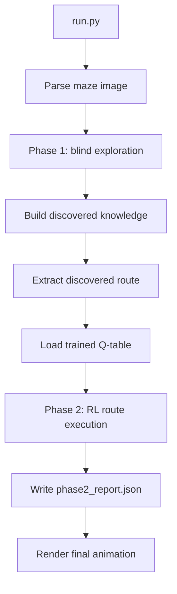
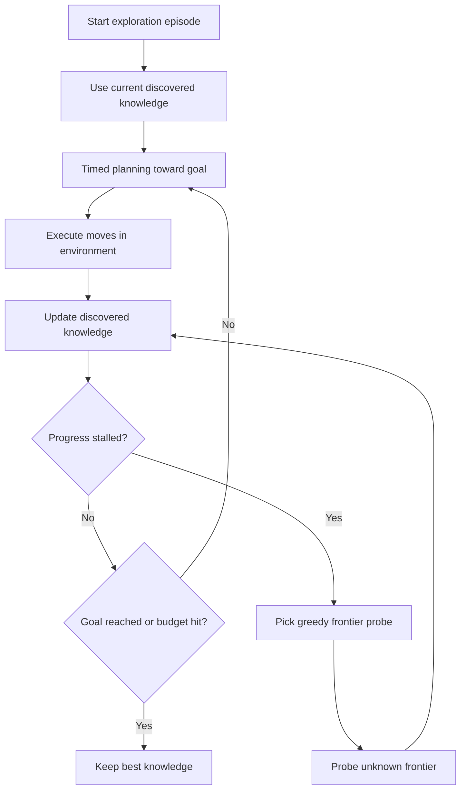
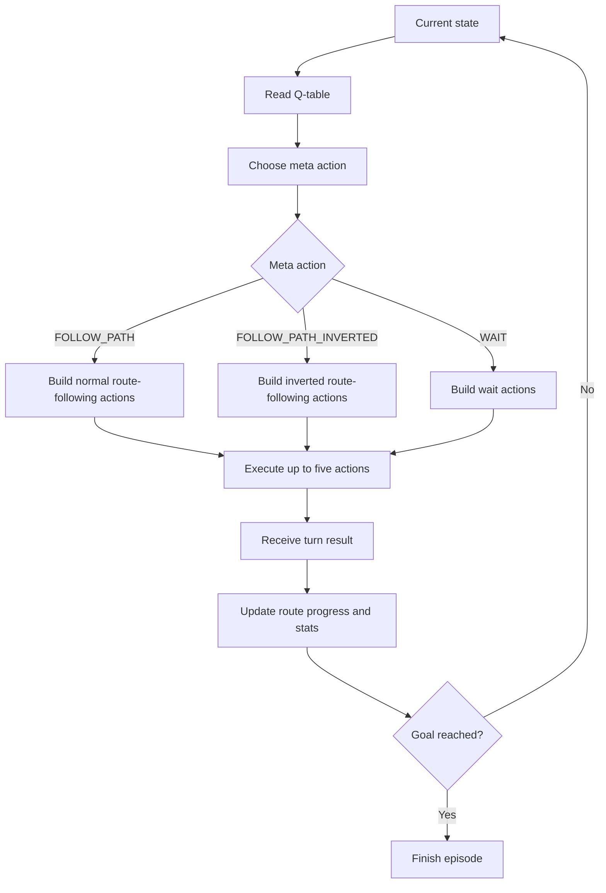

# MazeBot

MazeBot is a two-phase maze-solving system implemented in Python. The project combines blind exploration with reinforcement learning to solve image-based mazes that include dynamic hazards and control-altering tiles.

The primary workflow is:

1. explore the maze and build usable knowledge
2. extract a route from the discovered graph
3. use a trained RL policy to execute that route safely

The main entry point for the full project is:

```bash
python3 run.py
```

## Project Overview

MazeBot solves a maze parsed from an input image. The environment is not static. In addition to walls and open cells, the maze can contain:

- rotating fire hazards
- confusion tiles that reverse movement controls
- teleport pairs
- one-way gates

Because of these mechanics, the problem is not only about finding a geometric path. The system also has to account for timing, control inversion, and hazard-aware execution.

The project is organized into two coordinated phases:

- Phase 1: blind exploration and knowledge building
- Phase 2: RL-guided route execution

## Technology Stack

- Language: Python 3
- Array and matrix operations: `numpy`
- Image parsing: `opencv-python` / `cv2`
- Visualization: `matplotlib`

## Primary Workflow (`run.py`)

`run.py` is the main pipeline used to run the full system on `maze_gamma.png`.

At a high level, it performs the following steps:

1. load and parse the maze image
2. identify the start and goal cells
3. run blind exploration to build maze knowledge
4. extract a discovered route from the explored graph
5. load an existing trained Q-table from `qtable.json`
6. run the RL endgame using the discovered route
7. write `phase2_report.json`
8. render the final visualized episode

Important notes:

- `run.py` does not train the RL policy
- `run.py` expects a compatible `qtable.json`
- RL training and Q-table regeneration are handled separately by `run_RL.py`

## End-to-End Architecture



## Search And Control Strategy

MazeBot does not use a single algorithm from start to finish. The full `run.py` pipeline combines several search and control strategies:

- greedy frontier selection during exploration
- timed A*-style planning during exploration movement
- BFS route extraction after exploration
- RL-guided route execution in the final phase

The clearest summary is:

- Phase 1 builds the map
- BFS extracts the route from the discovered graph
- Phase 2 learns how to execute that route under maze dynamics

## Phase 1: Blind Exploration

Phase 1 is responsible for learning the maze without starting from full ground-truth knowledge.

### Goal

The purpose of phase 1 is to produce a usable internal representation of the maze by interacting with the real environment over repeated episodes.

The explorer gradually learns:

- which edges are open
- which edges are blocked
- which cells are teleports
- which cells are confusion tiles
- which fire phases are dangerous at specific cells

### Initial Knowledge

At the beginning of exploration, the system only assumes:

- maze size
- start cell
- goal cell

It does not begin with a trusted full map of walls, teleports, or safe timing windows.

### Knowledge Representation

Phase 1 stores its learned information in `BlindKnowledge`. This structure keeps:

- visited cells
- observed tile types
- open edges
- blocked edges
- discovered teleport mappings
- dangerous cells and deadly fire phases
- confusion cells

This knowledge persists across exploration episodes, which allows later episodes to reuse what earlier runs discovered.

### How Exploration Works

Each exploration episode begins at the start cell and runs until one of the following happens:

- the goal is reached
- the step budget is exhausted
- no valid progress can be made

During an episode, the explorer moves in the real environment and continuously updates `BlindKnowledge` based on what actually happens.

Examples of useful discoveries include:

- hitting a wall and marking that edge as blocked
- crossing an edge and marking it as open
- triggering a teleport and recording its destination
- dying on fire and storing the dangerous phase for that cell
- entering a confusion tile and marking it as such

### Exploration Planning Logic

Phase 1 uses two complementary planning behaviors.

#### 1. Timed goal-directed planning

The explorer uses a timed A*-style planner to move toward the goal. The planner reasons over `(cell, time)` states rather than only position.

This matters because a move is only useful if it is both:

- spatially valid
- temporally safe with respect to the fire cycle

The planner can also choose to wait when waiting produces a safer next state.

#### 2. Greedy frontier probing

If exploration stalls, the system switches to frontier probing. In this mode it selects promising unknown cells near already visited territory and probes them directly.

The probe selection is greedy. It prefers frontier moves that are:

- reachable from the current explored graph
- closer to the goal
- cheaper to attempt from the current position

### Why Exploration Repeats Across Episodes

Exploration is intentionally iterative. A failed episode is still useful because it adds information to shared knowledge.

Over repeated episodes, the system becomes more effective because it can:

- avoid previously confirmed blocked edges
- reuse discovered teleports
- avoid previously observed deadly fire timings
- expand the discovered graph more efficiently

### Output Of Phase 1

At the end of phase 1, `run.py` has:

- a populated `BlindKnowledge` structure
- a discovered route from start to goal

That route is extracted with BFS over the discovered graph, not from the full hidden maze.

This distinction is important:

The route used in phase 2 is the shortest route through what phase 1 has discovered, not necessarily the shortest route in the unseen full environment.

### Phase 1 Configuration

The exploration configuration is currently:

| Setting | Value |
| --- | --- |
| `MAZE_SIZE` | `64` |
| `FIRE_PHASE_COUNT` | `4` |
| `FIRE_PHASE_TICKS` | `5` |
| `TRAIN_EPISODES` | `220` |
| `TRAINING_STEP_BUDGET` | `4500` |
| `MAX_PHYSICAL_STEPS` | `20000` |
| `STALL_FRONTIER_TRIGGER` | `300` |
| `SUCCESS_STREAK_TO_STOP` | `1` |

### Phase 1 Flow



## Phase 2: RL Route Execution

Phase 2 takes the route and discovered maze structure produced by phase 1 and focuses on safe execution.

### Inputs From Phase 1

Phase 2 receives:

- the discovered route
- discovered open edges
- discovered blocked edges
- discovered teleports
- discovered tile observations
- start and goal positions

These are used to build a `RouteExecutionAgent`.

### Core Idea

In `run.py`, the RL policy is not performing a fresh global path search every turn. Instead, phase 2 follows the fixed route discovered in phase 1 and uses RL to decide how that route should be executed under dynamic maze conditions.

That is the intended division of responsibilities:

- Phase 1 decides where the route is
- Phase 2 decides how to follow it robustly

### How Phase 2 Works

At every turn:

1. the agent reads its current RL state
2. the Q-table selects a meta action
3. the meta action is expanded into primitive environment actions
4. the environment executes up to five actions
5. the result is used to update progress and report statistics

During the final `run.py` execution, epsilon is set to `0.0`, so the policy acts greedily using the learned Q-values.

### Route-Following Behavior

The `RouteExecutionAgent` keeps the fixed route produced by phase 1.

If the current position is already on the route, the agent follows the remaining suffix of that route.

If the agent deviates from the exact route, it does not compute a brand-new arbitrary path. Instead, it attempts to reconnect to a valid future point on the same discovered route.

This makes the phase-2 behavior route-aligned rather than free-form replanning.

### Output Of Phase 2

Phase 2 produces:

- a full endgame episode result
- a final visualization
- `phase2_report.json` with route and execution statistics

### Phase 2 Flow



## How The Two Phases Work Together

The two phases are designed to solve different parts of the same problem.

Phase 1 is responsible for building knowledge under uncertainty.
Phase 2 is responsible for executing a discovered route under dynamic runtime conditions.

This split keeps the system modular:

- exploration handles mapping and discovery
- RL handles timing-sensitive route execution

In practice, this means `run.py` works as:

1. discover enough of the maze to build a usable route
2. hand that route to the route-execution agent
3. let the RL policy choose how to follow it turn by turn

## Reinforcement Learning Design

### RL State

The RL state is a 4-value tuple:

| State Component | Meaning |
| --- | --- |
| `row` | current row |
| `col` | current column |
| `confused_flag` | `1` when controls are reversed, otherwise `0` |
| `fire_phase` | active fire phase at the current turn |

This gives the policy the minimum information needed to make timing-aware execution decisions.

### RL Action Space

The RL policy uses meta actions rather than raw low-level movement choices.

| Meta Action | Purpose |
| --- | --- |
| `FOLLOW_PATH` | follow the route normally |
| `FOLLOW_PATH_INVERTED` | follow the route using inverted controls |
| `WAIT` | remain in place for the turn |

Available actions depend on whether the agent is confused:

- normal state: `FOLLOW_PATH`, `WAIT`
- confused state: `FOLLOW_PATH`, `FOLLOW_PATH_INVERTED`, `WAIT`

This design allows the policy to react directly to confusion without changing the route itself.

### Reward Function

The reward function is configured as follows:

| Event | Reward |
| --- | --- |
| goal reached | `+100.0` |
| death | `-100.0` |
| wall hit | `-10.0` per hit |
| successful path-following move | `+2.0` |
| wait | `-2.0` |
| step cost | `-0.5` |
| no-progress path action | `-2.0` |

This reward design encourages:

- reaching the goal quickly
- avoiding deaths and wall collisions
- making real forward progress
- using waiting only when it is strategically useful

### Q-Learning Configuration

The default Q-learning configuration is:

| Parameter | Value |
| --- | --- |
| `alpha` | `0.1` |
| `gamma` | `0.95` |
| `epsilon` | `1.0` |
| `epsilon_min` | `0.05` |
| `epsilon_decay` | `0.995` |

The Q-table is saved to `qtable.json`.

### Turn Model

The environment supports up to `5` primitive actions per turn.

This is an important design detail. The RL policy chooses a meta action for the turn, and that meta action is then expanded into a short sequence of primitive moves or waits.

As a result, the learned behavior is about turn-level control, not only single-step movement.

## RL Training Workflow

The trained Q-table used by `run.py` is generated separately by `run_RL.py`.

`run_RL.py` uses the standard `MazeAgent` with the full parsed environment and trains a Q-table if a compatible one is not already present.

The current training utility configuration is:

| Setting | Value |
| --- | --- |
| `IMAGE_PATH` | `maze_alpha.png` |
| `MAZE_SIZE` | `64` |
| `TRAIN_EPISODES` | `500` |
| `MAX_TURNS_PER_EP` | `5000` |
| `VISUALIZE_EVERY` | `50` |
| `ANIMATION_FRAME_MS` | `100` |

Training proceeds as follows:

1. initialize or load a Q-table
2. run repeated episodes
3. apply epsilon-greedy action selection during training
4. decay epsilon after each episode
5. periodically visualize training progress
6. save the final Q-table to `qtable.json`

Once the Q-table exists, `run.py` reuses it with epsilon forced to `0.0` for deterministic endgame execution.

## Environment Mechanics

The runtime environment includes several mechanics that directly affect both phases.

### Walls

Walls block movement between adjacent cells. Exploration learns walls by direct interaction.

### Fire

Fire rotates through multiple phases over time. A cell that is safe in one phase may be lethal in another.

### Confusion

Confusion reverses movement controls for a limited number of turns. This is why the policy includes both normal and inverted route-following actions.

### Teleports

Teleport cells move the agent instantly to a paired location. Exploration records these mappings as they are discovered.

### One-Way Gates

One-way gates restrict legal movement to a single exit direction from specific cells.

### Multi-Action Turns

Each turn can contain between one and five primitive actions. This affects both fire timing and how route-following actions are expanded.

## Key Components

| File | Responsibility |
| --- | --- |
| `run.py` | full two-phase pipeline |
| `exploration/explorer.py` | blind exploration engine |
| `exploration/planning.py` | frontier probing, timed planning, BFS route extraction |
| `exploration/knowledge.py` | exploration memory model |
| `route_execution.py` | route-execution agent for phase 2 |
| `agent.py` | shared agent logic and turn planning |
| `qlearning.py` | RL state, action space, reward logic, Q-table updates |
| `environment/runtime.py` | runtime maze rules |
| `evaluation.py` | phase-2 evaluation and report writing |
| `visualizer.py` | animated replay |

## Running The Project

Run the full two-phase pipeline:

```bash
python3 run.py
```

Expected outputs:

- console summaries for exploration and phase 2
- `phase2_report.json`
- final animated replay

If a compatible `qtable.json` is missing, regenerate it with the training utility:

```bash
python3 run_RL.py
```

## Summary

MazeBot is built around a deliberate separation of concerns:

- blind exploration builds a reliable discovered graph
- BFS extracts a route from that graph
- reinforcement learning decides how to execute the route under dynamic maze rules

That design makes `run.py` the complete project pipeline: explore first, then execute the discovered route with RL-guided control.
